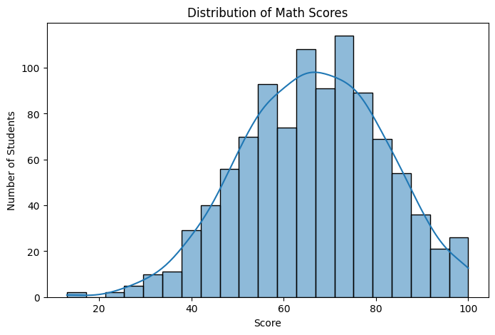
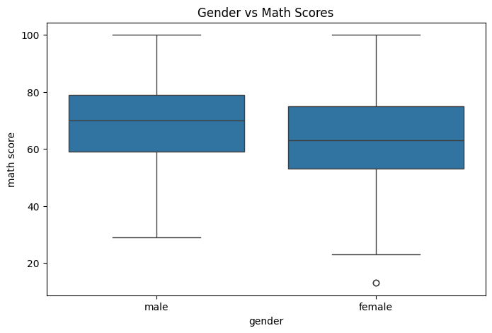
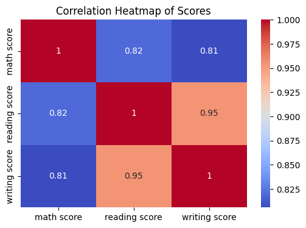

# 📊 Student Performance Exploratory Data Analysis (EDA)

## 📌 Project Overview
This project performs **Exploratory Data Analysis (EDA)** on a student performance dataset to understand how various factors such as **gender, parental education, lunch type, and test preparation** influence academic scores.

The goal is to identify patterns, relationships, and insights using data analysis and visualization techniques.

---

## 🎯 Objectives
- Understand the structure and quality of the dataset  
- Analyze the distribution of student scores  
- Study the impact of demographic and academic factors on performance  
- Visualize relationships between variables  
- Derive meaningful insights from the data  

---

## 📁 Dataset
- **Name:** Student Performance Dataset  
- **Number of records:** 1000 students  
- **Subjects:** Math, Reading, Writing  

### Features:
- Gender  
- Race/Ethnicity  
- Parental level of education  
- Lunch type  
- Test preparation course  
- Math score  
- Reading score  
- Writing score  

---

## 🛠️ Tools & Libraries Used
- Python  
- Pandas  
- NumPy  
- Matplotlib  
- Seaborn  
- Jupyter Notebook  

---

## 🔍 Steps Performed
1. Imported necessary Python libraries  
2. Loaded and inspected the dataset  
3. Checked data types and missing values  
4. Performed univariate analysis on score distributions  
5. Conducted bivariate analysis using boxplots  
6. Visualized categorical and numerical relationships  
7. Analyzed correlations between academic scores  
8. Summarized key insights  

---

## 📊 Visualizations Included
- Score distribution histogram  
- Gender-wise score comparison  
- Test preparation vs performance  
- Correlation heatmap  

---

## 📸 Screenshots & Plots

### 📊 Score Distribution
Distribution of Math scores among students.



---

### 📦 Gender-wise Score Comparison
Comparison of Math scores based on gender.



---

### 📚 Test Preparation vs Performance
Impact of test preparation courses on Math scores.


---

### 🔥 Correlation Heatmap
Correlation between Math, Reading, and Writing scores.



---

## 💡 Key Insights
- Students who completed test preparation courses scored higher on average  
- Reading and writing scores show a strong positive correlation  
- Parental education level has a moderate influence on student performance  
- Lunch type is associated with variations in academic scores  

---

## 📌 Conclusion
This project demonstrates how exploratory data analysis helps uncover patterns and relationships within educational data. The insights gained can assist educators and policymakers in improving student outcomes.

---

## 📎 How to Run the Project
1. Clone this repository  
2. Install required libraries:
   ```bash
   pip install pandas numpy matplotlib seaborn
## Author
Sai Harshith

## Contact
GitHub: https://github.com/SaiHarshith01
